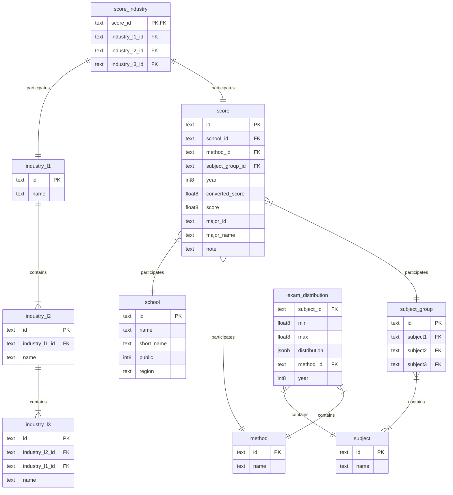

<h1 align="center">🎓 Cổng Đại học – The Universities' Gateway</h1>

  

  <a href="https://congdaihoc.netlify.app/"><b>🌐 Visit Website</b></a> •
  <a href="#-tech-stack">💻 Tech Stack</a> •
  <a href="#-database-architecture">🗂 Database</a> •
  <a href="#-data-processing-pipeline">📊 Data Pipeline</a> •
  <a href="#-client-side-architecture">🧠 Client Logic</a> •
  <a href="#-future-development">🚀 Future</a>

---

## 🌍 Overview

**Cổng Đại học** (_“Universities’ Gate”_) is a web platform that helps Vietnamese students explore **university admissions**, **compare exams**, and **discover suitable majors**.

It integrates a large-scale admissions dataset, smart score conversions, and a modern interface — making it a one-stop portal for college admission guidance in Vietnam.

### ✨ Key Features

1. 🧭 **Career Personality Assessment** — Take the Holland Test and discover your personality type.
2. 🧮 **Admission Score Calculation** — Combine GPA, exam results (TSA, HSA, V-ACT, SPT, H-SCA…), and international certificates (IELTS, SAT, etc.).
3. 🎯 **University & Major Lookup** — Explore suitable universities and majors based on your score.
4. 📊 **Exam Distribution Visualization** — Compare and analyze exam score distributions.
5. 🔄 **Cross-Exam Score Conversion** — Convert scores using linear or percentile-based models.
6. 📚 **Additional Information Lookup** — Access documents and policies from the Ministry of Education and Training.

---

## 💪 Strengths

✅ Simple, user-friendly interface  
📊 Huge, well-structured data warehouse  
🧠 Versatile and diverse features supporting many use cases

---

## 🧰 Tech Stack

| Layer               | Technologies                                                                                                                                                                                                                                                                                                                                                            |
| ------------------- | ----------------------------------------------------------------------------------------------------------------------------------------------------------------------------------------------------------------------------------------------------------------------------------------------------------------------------------------------------------------------- |
| **Frontend**        |                                                                                                                                                                                      |
| **Database**        |                                                                                                                                                                                                                                                                                  |
| **Data Processing** |     |

---

## 🗂 Database Architecture

The system stores admission and exam data in **Supabase**, structured as follows:

📂 Explore database and data samples:
👉 Google Drive Folder

📊 Data Processing Pipeline

crawling_score.py – Crawl raw admission data from educational websites.

handle_converted.py – Linear score normalization.

get_converted_score.js – Percentile-based score conversion.

generate_score_industry.py – Build relationships between score and industry_l3.

Push to database – Upload cleaned and verified data to Supabase.

⚠️ Note

get_converted_score.js uses web modules for fast conversion but may introduce encoding inconsistencies → all data is finalized using Pandas.

Percentile-based conversion aligns equivalent percentiles between two exams.

The average margin of conversion error is ±2 points (on a 30-point scale) — acceptable for comparison.

🧮 Conversion Flow

Standardize method names: uttt, xtkh → thpt, thhb, dgsg, dghn, dgtd.

Apply linear conversion → unify score scales (thpt: 30, dgsg: 1200, etc.).

Apply percentile conversion → align all results on a 30-point scale.

🧠 Client-Side Architecture
UX Enhancements
File Description
loading.js Displays loading screen
toast.js Handles notification toasts
Shared Models
File Purpose
code_model.js Stores user data
html_code_consts.js HTML templates for UI components
filter_model.js Encodes/decodes admission score results
holland_model.js Encodes/decodes Holland test results
query_model.js Stores query state and statistics
score_convert_model.js Numeric helpers (rounding, conversion, sorting, averaging)
Page-Specific Scripts
HTML Page Script File Description
compare.html compare.js Exam comparison and visualization
convert.html convert.js Score conversion
filter.html filter.js Admission filtering & major recommendation
general_statistics.html general_statistics.js General stats display
holland.html holland.js Holland personality test
introduce_industry_school.html introduce.js Industry & school introduction page
🧾 Data Views
View Description
view_score Combines essential data for major recommendation
view_admission_unit Joins score and industry data
view_top_mean Ranks universities by median score (excl. GPA-based)
view_top_mean_by_industry3 Ranks majors by median score
view_specific_ratio Measures school specialization level
📚 References

https://diemthi.tuyensinh247.com/
– Main data source

Official publications from the Ministry of Education and Training (Vietnam)

Personal research and experience

🚀 Future Development

🤖 AI-based major recommendation (using semantic similarity)

📈 Predictive modeling for next-year cutoffs

🌍 English and international version for overseas students

🧩 Public API for education and research data access
