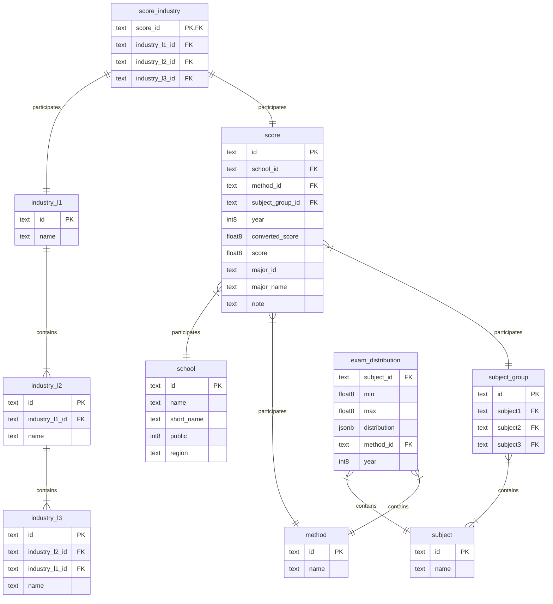

# Giới thiệu Cổng Đại học

**Cổng Đại học** là bộ trang web hỗ trợ thí sinh tra cứu thông tin tuyển sinh. Gồm các chức năng:

Link [Cổng Đại học](https://congdaihoc.netlify.app/).

1. Tra cứu tính cách nghề nghiệp dựa vào Trắc nghiệm Holland.
2. Tính điểm thực tế của thí sinh, gồm có: Điểm học bạ, điểm TN THPT, điểm TSA, HSA, V-ACT, V-SAT, SPT, H-SCA, ĐGTSĐH CAND, có kết hợp điểm IELTS, chứng chỉ tuyển sinh quốc tế và thành tích cá nhân.
3. Tra cứu các Ngành và Trường dựa trên kết quả tính toán mục 1 và 2.
4. Vẽ biểu đồ so sánh phổ điểm.
5. Quy đổi điểm giữa các kỳ thi dựa trên phân vị tương đương giữa các kỳ thi.
6. Tra cứu các thông tin khác (văn bản đơn thuần).

**Công nghệ sử dụng:**

- **Front-end**: _Bootstrap_, _Chart.js_.
- **Cơ sở dữ liệu**: _Supabase_.
- **Thu thập dữ liệu**: _Selenium_ (cào dữ liệu), _Pandas_ (xử lý dữ liệu), _sentence_transformers_ (nhận diện ngữ nghĩa và phân loại dữ liệu).

# Quy trình xử lý dữ liệu

## Cơ sở dữ liệu

Mỗi record của bảng `score` được gọi là một _đơn vị tuyển sinh_, gồm có 2 field quan trọng:

- `converted_score` là điểm quy đổi về thang 30, được dùng để so sánh với điểm của người dùng.
- `score` là điểm chuẩn gốc.

Hệ thống ngành, nhóm ngành được chia thành 3 cấp độ:

1. `industry_l1`: Nhóm ngành.
2. `industry_l2`: Nhóm ngành con.
3. `industry_l3`: Ngành cụ thể / chuyên ngành.

Các tổ hợp môn được lưu trong bảng `subject_group`, gồm có:

1. 220 tổ hợp thông thường, đánh số từ `G001` đến `G220`. Trong `crawling_score.py` có hàm ánh xạ từ tên tổ hợp thông thường sang tổ hợp G-based.
2. Tổ hợp `A000` tượng trưng cho các môn tổng hợp (V-ACT, HSA, TSA,...)
3. Tổ hợp `A001` tượng trưng cho các khối có môn năng khiếu. Trong bảng `subject` ghi nhận 7 môn năng khiếu khác nhau nhưng chưa áp dụng vào hệ thống vì các môn năng khiếu được xét riêng biệt theo từng trường tổ chức thi năng khiếu, chưa tìm thấy điểm chung.

Khi người dùng truy vấn dữ liệu thì không truy vấn trực tiếp bảng mà thông qua các **view** sau:

1. `view_score`: Chứa các dữ liệu cần khi gợi ý ngành, như tên trường, tên ngành,... (bảng `score` không lưu các thông tin này).
2. `view_admission_unit`: Chứa thông tin ghép lại từ bảng `score` và các industry.
3. `view_top_mean`: Xếp hạng các trường theo trung vị điểm chuẩn, không bao gồm phương thức học bạ.
4. `view_top_mean_by_industry3`: Xếp hạng các ngành theo trung vị điểm chuẩn, không bao gồm phương thức học bạ.
5. `view_specific_ratio`: Xếp hạng mức độ trọng tâm của các trường theo lĩnh vực đào tạo, tức là trường nào dạy ngành nào là nhiều nhất.

## Quy trình thu thập dữ liệu điểm chuẩn và đưa vào cơ sở dữ liệu

1. Lấy dữ liệu thô từ các trang web (`crawling_score.py`).
2. Quy đổi điểm tuyến tính (`handle_converted.py`).
3. Quy đổi theo phổ điểm (`get_converted_score.js`).
4. Tạo bảng mối giữa bảng điểm (`score`) và bảng các ngành (`industry_l3`) (`generate_score_industry.py`).
5. Đưa vào cơ sở dữ liệu.

Chú ý:

- File `get_converted_score.js` có ưu điểm tận dụng được các module chức năng của trang web, nhưng vô tình mã hóa sai lệch dữ liệu nên cần phải thông qua Pandas để xử lý sau cùng.
- **Quy đổi tuyến tính** là nhân chia số điểm đó về thang điểm mong muốn.
- **Quy đổi theo phổ điểm** là dựa trên phân vị tương ứng giữa 2 phổ điểm giữa 2 kỳ thi mà quy đổi. Độ sai số quy đổi của trang web là **2 (thang 30)**, nhưng không quan trọng vì toàn bộ trang web đều có sai số như nhau nên đều có ý nghĩa tìm kiếm ngành.

Flow quy đổi:

1. Quy đổi các phương thức `uttt` và `xtkh` thành `thpt`, `thhb`, `dgsg`, `dghn`, `dgtd`, tùy theo từng đơn vị tuyển sinh.
2. Quy đổi **tuyến tính** các phương thức về đúng thang điểm của nó (VD `thpt` -> thang 30, `dgsg` -> thang 1200).
3. Quy đổi **theo phổ điểm** các kỳ thi riêng về thang 30.

## Các file xử lý phía client

**Các file nâng cao UX**:

1. `loading.js`: Hiển thị, ẩn màn hình loading.
2. `toast.js`: Hiển thị, ẩn toast.

**Các file sau chứa các thuộc tính và phương thức xử lý chung, được import bởi các file khác:**

1. `code_model.js`: Lưu trữ thông tin user. Dùng bởi `filter.js` và `holland.js`.
2. `html_code_consts.js`: Các HTML template selectpicker, box,...
3. `filter_model.js`: Lưu trữ, encode, decode thông tin điểm số, thành tích,...
4. `holland_model.js`: Lưu trữ, encode, decode thông tin bài trắc nghiệm tính cách Holland.
5. `query_model.js`: Lưu trữ thông tin truy vấn, năm hiện tại, tính điểm xét tuyển, kết quả trắc nghiệm tính cách, truy vấn các ngành gợi ý, thống kê trung bình.
6. `score_convert_model.js`: Xử lý chung về dữ liệu điểm, như làm tròn, quy đổi điểm, sắp xếp, tính trung bình,...

**Các file xử lý cụ thể đối với từng HTML page**:

1. `compare.js`: `compare.html`.
2. `convert.js`: `convert.html`.
3. `filter.js`: `filter.html`.
4. `general_statistics.js`: `general_statistics.html`.
5. `holland.js`: `holland.html`.
6. `introduce.js`: `introduce_industry_school.html`.
