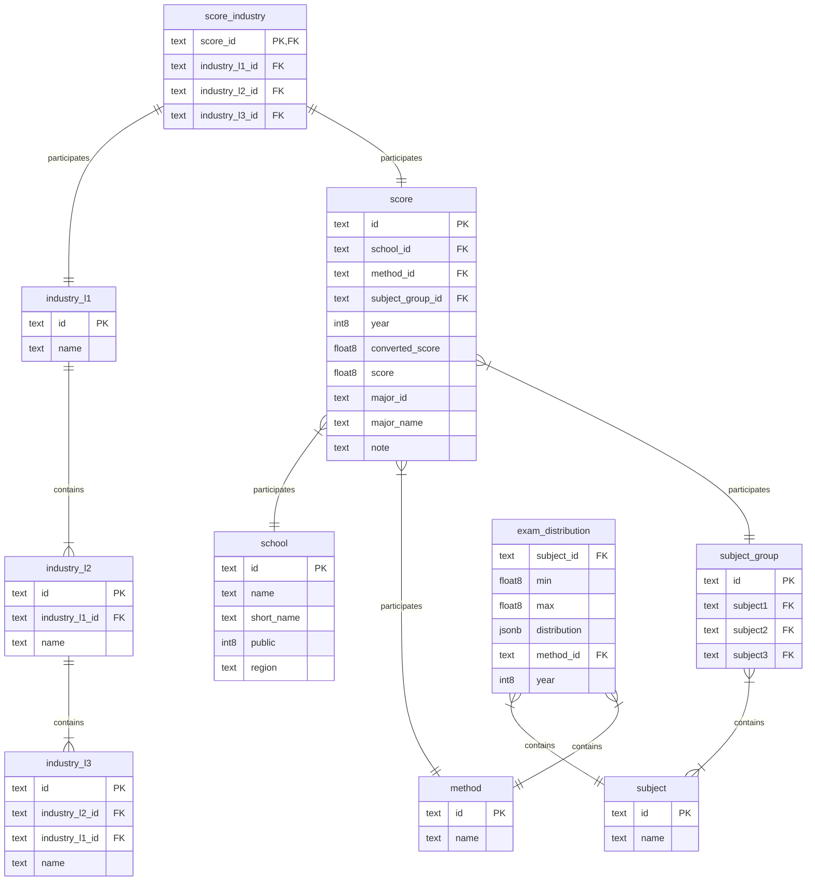

# Introduction to **Cổng Đại học** (Universities' Gate)

*You can visit the website [here](https://congdaihoc.netlify.app/).*

## Overview

**Cổng Đại học** is a web platform designed to help Vietnamese students explore university admissions information and make informed career decisions.

### Key features

1. **Career Personality Test** — Take the **Holland’s test** to identify your career personality type.  
2. **Admission Score Calculation** — Calculate your admission scores using multiple sources:
   - High school reports  
   - National high school exam  
   - University-specific tests (TSA, HSA, V-ACT, V-SAT, SPT, H-SCA, etc.)  
   - International certificates and academic achievements  
3. **Major & University Lookup** — Explore academic majors and universities that match your calculated results.  
4. **Score Distribution Visualization** — Plot and compare admission score distributions across exams.  
5. **Score Conversion** — Convert scores between exams using **linear** or **percentile-based** scaling.  
6. **Information Lookup** — Access other academic and admission-related resources.

## Strengths

- **Simple, user-friendly interface**  
- **Extensive data warehouse**  
- **Flexible features** serving multiple educational and analytical purposes  

## Tech Stack

| Layer | Technologies |
|-------|---------------|
| 🖥️ **Frontend** |   |
| 🗄️ **Database** |  |
| 🔍 **Data Crawling & Processing** |     |

## Data processing pipeline

### Overview about database schema

```mermaid
erDiagram
    school {
        text id PK
        text name
        text short_name
        int8 public
        text region
    }

    score {
        text id PK
        text school_id FK
        text method_id FK
        text subject_group_id FK
        int8 year
        float8 converted_score
        float8 score
        text major_id
        text major_name
        text note
    }

    score_industry {
        text score_id PK, FK
        text industry_l1_id FK
        text industry_l2_id FK
        text industry_l3_id FK
    }

    industry_l1 {
        text id PK
        text name
    }

    industry_l2 {
        text id PK
        text industry_l1_id FK
        text name
    }

    industry_l3 {
        text id PK
        text industry_l2_id FK
        text industry_l1_id FK
        text name
    }

    method {
        text id PK
        text name
    }

    subject_group {
        text id PK
        text subject1 FK
        text subject2 FK
        text subject3 FK
    }

    subject {
        text id PK
        text name
    }

    exam_distribution {
        text subject_id FK
        float8 min
        float8 max
        jsonb distribution
        text method_id FK
        int8 year
    }

industry_l1 ||--|{ industry_l2 : contains
industry_l2 ||--|{ industry_l3 : contains

score_industry ||--|| industry_l1 : participates
score_industry ||--|| score : participates

score }|--|| school : participates
score }|--|| method : participates
score }|--|| subject_group : participates

subject_group }|--|{ subject : contains
exam_distribution }|--|| subject : contains
exam_distribution }|--|| method : contains
```

*You can explore more details about the database schema and samples [here](https://drive.google.com/drive/folders/1F2Y_qL9LkSZMpTG3iGCtLU73b-tR-Jso?usp=drive_link).*

Each record in the `score` table represents an **admission unit**, with two main fields:

- `converted_score` → Score converted to the 30-point scale (for comparison between users).  
- `score` → Original admission score.

The **industry hierarchy** is divided into 3 levels:

| Level | Description |
|--------|--------------|
| `industry_l1` | Major group |
| `industry_l2` | Sub-group |
| `industry_l3` | Specific major |

### Subject groups

The `subject_group` table includes:

1. **220 normal groups** (from `G001` → `G220`), called _G-based groups_.  
   (The mapping function from normal groups → G-based groups is located in `crawling_score.py`.)
2. `A000` — Represents “No-group”.  
3. `A001` — Represents gifted-subject groups (e.g., Art, Music, Sports).  
   Gifted subjects are stored in the `subject` table but **not yet linked** to `subject_group`, since each university handles them differently.

### Database views

Users query **views**, not raw tables, to ensure optimized and meaningful data:

| View | Description |
|------|--------------|
| `view_score` | Contains key data for major recommendation (school & major names). |
| `view_admission_unit` | Combines data from `score` and `industry` tables. |
| `view_top_mean` | Ranks universities by median admission score (excluding high school reports). |
| `view_top_mean_by_industry3` | Ranks majors by median admission score (excluding high school reports). |
| `view_specific_ratio` | Measures how concentrated a university is in specific fields. |

## Admission data workflow

1. **Data Crawling** — `crawling_score.py`  
   → Fetches raw data from public sources.  
2. **Linear Conversion** — `handle_converted.py`  
   → Converts raw scores into a unified scale.  
3. **Percentile Conversion** — `get_converted_score.js`  
   → Uses percentile matching between two exams.  
4. **Mapping** — `generate_score_industry.py`  
   → Links scores with industries (`score` ↔ `industry_l3`).  
5. **Database Push** — Final cleaned data is uploaded to Supabase.

>[!caution]
> - `get_converted_score.js` uses site-based functions for convenience but **encodes data incorrectly** → requires **final cleaning via Pandas**.  
> - **Percentile conversion** is based on exam percentile equivalence (average error: ±2 on 30-point scale), but consistent across the system → *reliable for comparison*.

### Conversion flow summary

1. Normalize methods `uttt`, `xtkh` → `thpt`, `thhb`, `dgsg`, `dghn`, `dgtd`.
2. Apply **linear conversion** → bring each method to its official scale.
3. Apply **percentile conversion** → convert to 30-point scale.

## Client-side Structure

### UX enhancement scripts

| File | Description |
|------|--------------|
| `loading.js` | Show/Hide loading screen |
| `toast.js` | Display/Hide toast notifications |

### Data models

| File | Description |
|------|--------------|
| `code_model.js` | Stores user information (used by `filter.js`, `holland.js`). |
| `html_code_consts.js` | HTML templates (selectpickers, boxes, etc.). |
| `filter_model.js` | Encode/decode admission results. |
| `holland_model.js` | Encode/decode Holland test results. |
| `query_model.js` | Stores query info, year, test results, recommendations, and stats. |
| `score_convert_model.js` | General score processing (rounding, conversion, sorting, averaging). |

### References scripts to HTML pages

| Page | Script |
|------|---------|
| `compare.html` | `compare.js` |
| `convert.html` | `convert.js` |
| `filter.html` | `filter.js` |
| `general_statistics.html` | `general_statistics.js` |
| `holland.html` | `holland.js` |
| `introduce_industry_school.html` | `introduce.js` |

## Some references

1. [https://diemthi.tuyensinh247.com/](https://diemthi.tuyensinh247.com/) — Main data source.  
2. Official documents from the **Vietnamese Ministry of Education and Training (MOET)**.  
3. Personal research and experience.

## Future plans

- Integrate AI-based **major recommendation**.
- Expand **gifted subject system** into subject group logic.
- Provide **real-time admission trend visualizations**.
- Add **career pathway recommendations** based on user profiles.
- ...
